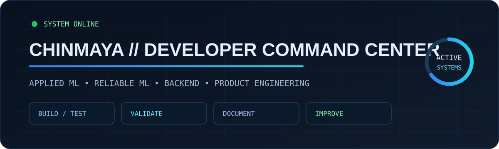
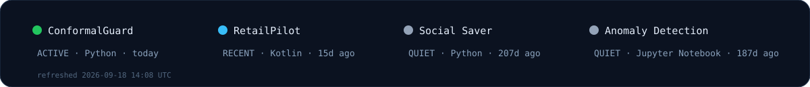

<div align="center">



### Kamireddy Chinmaya Satyam

**Computer Science & Artificial Intelligence · ML Reliability · Backend Systems · Security ML**

`BUILD` → `TEST` → `VALIDATE` → `DOCUMENT` → `IMPROVE`

[ConformalGuard](https://github.com/chinmaygit-lab/ConformalGuard) ·
[RetailPilot](https://github.com/chinmaygit-lab/retailpilot) ·
[Social Saver](https://github.com/chinmaygit-lab/social-saver-cognitive-engine) ·
[Anomaly Detection](https://github.com/chinmaygit-lab/Anomaly-Detection-Model)

</div>

---

## ◈ Command Center

<!-- DASHBOARD:START -->
| System | State | Language | Last push | Latest commit |
|---|---|---|---|---|
| [ConformalGuard](https://github.com/chinmaygit-lab/ConformalGuard) | `ACTIVE` | Python | 17h ago | [feat: add multi-dataset robustness benchmark suite](https://github.com/chinmaygit-lab/ConformalGuard/commit/d89a86ffdfa4a1730a619c88c3ec853b874ba195) |
| [RetailPilot](https://github.com/chinmaygit-lab/retailpilot) | `ACTIVE` | Kotlin | 15h ago | [feat: productize RetailPilot v1 release workflow](https://github.com/chinmaygit-lab/retailpilot/commit/a8ccb412f871276d990a955dd045f83905a4bc94) |
| [Social Saver](https://github.com/chinmaygit-lab/social-saver-cognitive-engine) | `QUIET` | Python | 211d ago | [Revise README with project details and demo link](https://github.com/chinmaygit-lab/social-saver-cognitive-engine/commit/710956c9caee62b2fe88be25332bc3b7a5036794) |
| [Anomaly Detection](https://github.com/chinmaygit-lab/Anomaly-Detection-Model) | `QUIET` | Jupyter Notebook | 190d ago | [Update README.md](https://github.com/chinmaygit-lab/Anomaly-Detection-Model/commit/349cb48dd3985fc338a09882e2c97899261af840) |

**Current workstream:** Finishing ConformalGuard v1.0  
**Dashboard refreshed:** 2026-09-22 08:37 UTC
<!-- DASHBOARD:END -->

<p align="center">
  
</p>

## ◈ Systems

<table>
<tr>
<td width="50%" valign="top">

### 🛡️ ConformalGuard
**Reliable ML / Conformal Prediction**

Framework for evaluating conformal prediction under distribution shift with reproducible IID, covariate-shift, label-shift, robustness reporting, visualization, and concept-shift experiments.

**Stack:** Python · Scikit-learn · MAPIE · Pandas · NumPy

[Repository →](https://github.com/chinmaygit-lab/ConformalGuard)

</td>
<td width="50%" valign="top">

### 📱 RetailPilot
**Android Product Engineering**

A modular Android project with a structured architecture and validation-focused development workflow.

**Focus:** modular architecture · application engineering · validation

[Repository →](https://github.com/chinmaygit-lab/retailpilot)

</td>
</tr>
<tr>
<td width="50%" valign="top">

### 🧠 Social Saver Cognitive Engine
**Backend / Information Retrieval**

AI-powered system for organizing and retrieving saved URLs, notes, and text through ingestion, search, scoring, resurfacing, and an interactive dashboard.

**Stack:** Python · FastAPI · Streamlit · SQLite

[Repository →](https://github.com/chinmaygit-lab/social-saver-cognitive-engine)

</td>
<td width="50%" valign="top">

### 🔍 Security Anomaly Detection
**Applied ML / Team Project**

Hybrid anomaly-detection pipeline using Transformer-VAE representations with Isolation Forest, One-Class SVM, and Local Outlier Factor.

**Stack:** Python · PyTorch · Scikit-learn

[Repository →](https://github.com/chinmaygit-lab/Anomaly-Detection-Model)

</td>
</tr>
</table>

## ◈ Capability Matrix

```text
RELIABLE ML     Conformal prediction · Distribution shift · Model evaluation
APPLIED ML      PyTorch · Scikit-learn · TensorFlow · Anomaly detection
DATA            Pandas · NumPy · Preprocessing · Feature engineering
BACKEND         FastAPI · REST APIs · SQLite · MySQL
ENGINEERING     Git · GitHub · Testing · Reproducible experiments
CORE CS         DSA · OOP · DBMS · Operating Systems · Computer Networks
```

## ◈ Current Workstream

```text
ConformalGuard
├── controlled concept shift generator        ✓
├── concept shift experiment sweep            ✓
├── multi-seed concept shift grid             →
├── robustness benchmark integration
└── v1.0 documentation + release
```

## ◈ Experience Signal

**Machine Learning Trainee — Software & Systems Security Bootcamp**

NITK Surathkal · Industry Partner: Saviynt · 2026

Worked on authentication/authorization-log analysis, preprocessing, feature engineering, anomaly detection, model evaluation, and reproducible ML workflows.

## ◈ Recent Public Activity

<!-- ACTIVITY:START -->
- **Push** · `chinmaygit-lab/retailpilot` · pushed commits · 15h ago
- **Release** · `chinmaygit-lab/retailpilot` · v1.0.0 · 15h ago
- **Push** · `chinmaygit-lab/ConformalGuard` · pushed commits · 17h ago
- **Push** · `chinmaygit-lab/ConformalGuard` · pushed commits · 19h ago
- **Push** · `chinmaygit-lab/ConformalGuard` · pushed commits · 19h ago
<!-- ACTIVITY:END -->

## ◈ Engineering Principles

```text
01  Prefer reproducible evidence over impressive-looking numbers.
02  Validate behavior with tests before calling a feature complete.
03  Keep experiments, reporting, and visualization separable.
04  Build software that can be explained, inspected, and extended.
05  Treat reliability as an engineering feature, not an afterthought.
```

---

<div align="center">

**Building practical ML systems, reliability tooling, and software products.**

[github.com/chinmaygit-lab](https://github.com/chinmaygit-lab)

</div>
